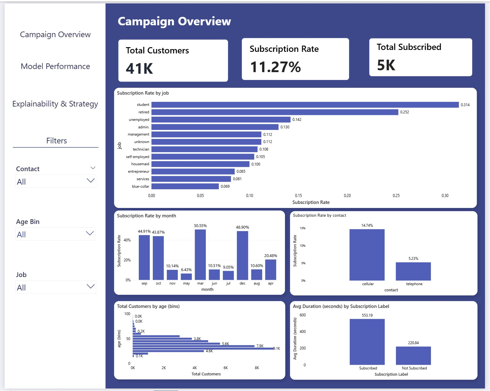
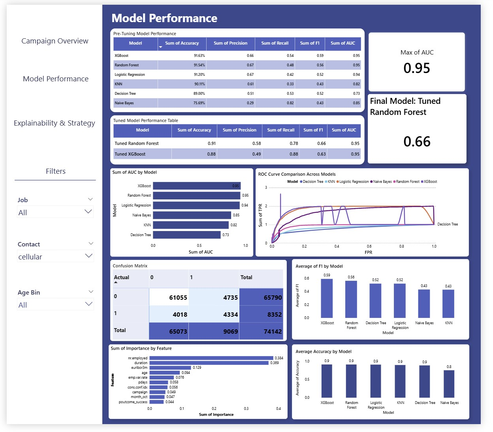
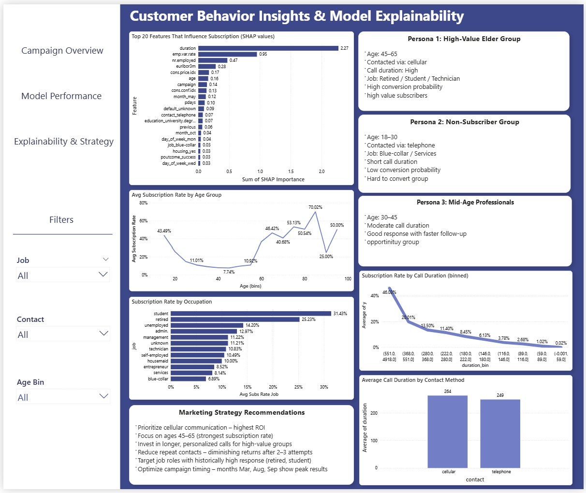

# 📊 Bank Marketing Campaign Analysis & Term Deposit Subscription Prediction  
### Modern EDA • Machine Learning • Model Explainability • Power BI Dashboard

This project analyzes the **Bank Marketing Dataset** from a Portuguese bank to identify which clients are most likely to subscribe to a term deposit.  
It simulates an **end-to-end data analytics pipeline** used by real data analysts and data scientists.

---

## Project Overview

This project demonstrates:

- Modern **Exploratory Data Analysis (EDA)** with clear business insights  
- Clean **data preprocessing pipeline**  
- **Six machine learning classification models**  
- Full evaluation using industry-standard metrics  
- **Confusion matrices, ROC curves, AUC scores**  
- **Feature importance (RF/XGB) & SHAP explainability**  
- A professional **Power BI dashboard** for business stakeholders  
- End-to-end deliverable like a real analytics project  

---

## 📁 Repository Structure

├── data/
│   ├── bank-additional-full.csv          # Raw dataset
│   ├── bank_marketing_bi_raw.csv         # Cleaned dataset for Power BI
│   ├── age_effect.csv                    # Subscription analysis by age bins
│   ├── job_effect.csv                    # Subscription analysis by job
│   ├── duration_effect.csv               # Call duration impact analysis
│   ├── contact_duration.csv              # Duration by contact method
│   ├── feature_importance.csv            # Feature importance from ML models
│   ├── shap_feature_importance.csv       # SHAP values export
│   ├── confusion_matrices.csv            # Model confusion matrix data
│   ├── model_performance.csv             # Pre-tuning model metrics
│   ├── tuned_model_performance.csv       # Tuned RF/XGB performance metrics
│   └── roc_curves.csv                    # ROC curve data for BI visuals
│
├── notebook/
│   └── bank_marketing_pipeline.ipynb     # Full analysis & ML workflow
│
├── powerbi/
│   └── bank_marketing_dashboard.pbix     # Power BI dashboard (3 pages)
│
├── images/
│   ├── page1.jpg                         # Dashboard page 1
│   ├── page2.jpg                         # Dashboard page 2
│   └── page3.jpg                         # Dashboard page 3
│
└── README.md

---

## 📊 Dataset Summary

- **Bank Marketing Dataset**  
- 45,211 records  
- 20+ demographic + economic + campaign features  
- Target variable:  
  - `y = yes` → client subscribed to term deposit  
  - `y = no` → did not subscribe  

---

## EDA Highlights (Key Insights)

- **Cellular contact consistently outperforms telephone**
- **Call duration is the strongest positive driver of subscription**
- **Older age groups show higher subscription interest**
- **Months like March, September show peak conversion**
- **Certain professions (retired, students) convert at much higher rates**

---

## Machine Learning Models Used

1. Logistic Regression  
2. Naive Bayes  
3. K-Nearest Neighbors  
4. Decision Tree  
5. Random Forest  
6. XGBoost  

Each model is evaluated on:

- Accuracy  
- Precision  
- Recall  
- F1  
- ROC-AUC  

---

## Model Evaluation Summary

The best performing models were:

- **XGBoost**  
- **Random Forest**

Both achieved the highest **AUC**, strong precision/recall, and stable performance.

---

## Handling Imbalanced Data & Final Model Selection

- The dataset is highly imbalanced (only ~11–12% subscribed).
- Because of this, accuracy is not meaningful—a model predicting all “no” would still score ~88% accuracy.
- Metrics like Precision, Recall, and F1-score were prioritized for evaluation.
- F1-score was used as the key metric because it balances precision and recall for the minority class.

---

## Final Model Choice:
- After hyperparameter tuning, **Tuned Random Forest** achieved the best overall **F1-score (0.66)** while maintaining a strong **AUC (0.95)**.
- Therefore, **Tuned Random Forest was selected as the final model**, and its performance was added to the Power BI dashboard.

## Explainability

### Feature Importance  
- Duration  
- Contact method  
- Month  
- Campaign count  

### SHAP Values  
Used to identify how individual features impact predictions.

---

## 📊 Power BI Dashboard

A professional business dashboard was built:

### **Page 1 — Marketing Campaign Insights**

- KPIs: Subscription rate, total customers, total subscribed  
- Subscription rate by:  
  - Job  
  - Contact type  
  - Month  
- Age distribution  
- Duration distribution  
- Campaign performance overview  

### **Page 2 — ML Model Performance**

- Model comparison table  
- AUC comparison  
- ROC curve visual  
- Confusion matrices  
- Feature importance bar charts  

---

### Page 3 — Customer Insights & Model Explainability

- SHAP feature importance to explain key drivers of the model
- Subscription behavior analyzed across age groups, occupations, and call duration
- Customer personas created for targeted marketing strategy
- Relationship between contact method and conversion visualized
- Actionable marketing recommendations based on model insights

---

## 🛠 Tools Used

- Python (Pandas, NumPy, Scikit-learn, XGBoost, SHAP)
- Seaborn & Matplotlib  
- Power BI  
- Google Colab / Jupyter  
- GitHub  

---
